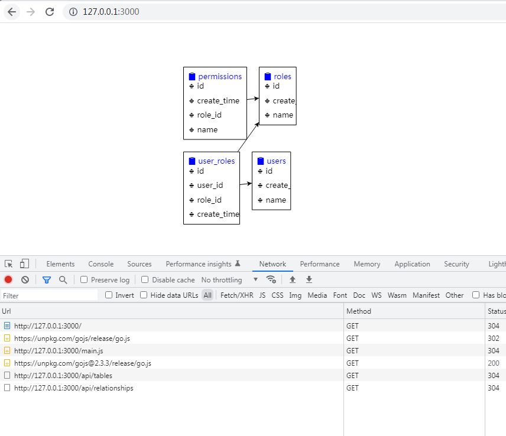

# AI 生成代码测试

测试一下用 [AI](https://www.cursor.so/) 写代码，用 NodeJS 把 MySQL 的所有表，列和主键，外键信息读取出来，并可视化它。

全程一行代码都不需要写，只需要修改数据库连接的配置即可。

调教代码的过程确实需要一些耐心和经验，如果生成的代码有问题，需要尝试更换提示词，直到满意为止。

最终效果确实非同凡响，没想到这么快能做出来一个能用的东西，AI 太强大了，我喜欢它。

最终想要这种效果，就差美化了
https://gojs.net/latest/samples/entityRelationship.html